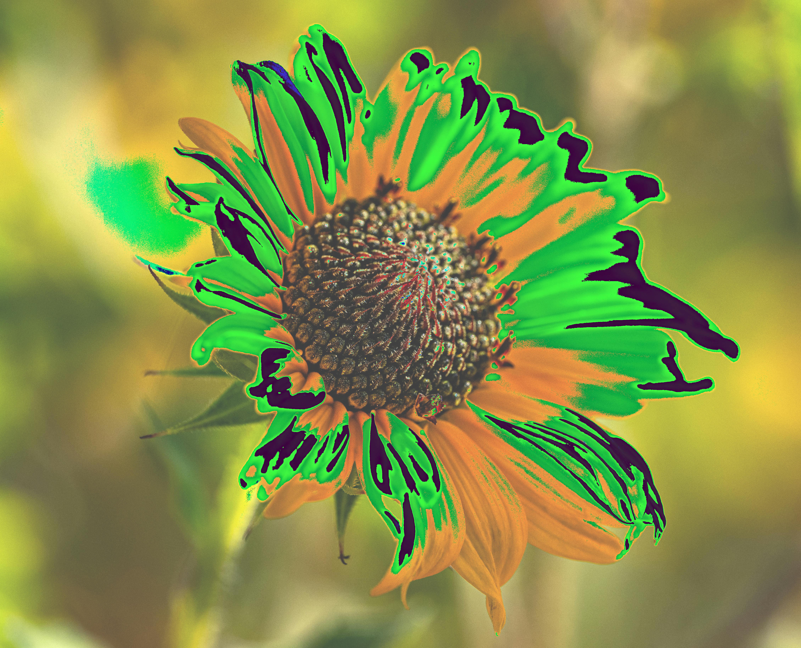

# Rusty Fotos

Table of contents

<!--toc:start-->

- [Rusty Fotos](#rusty-fotos)
  - [About](#about)
    - [Steps](#steps)
      - [Layer](#layer)
      - [Save](#save)
  - [Usage](#usage)
    - [CLI](#cli)
    - [GUI](#gui)

<!--toc:end-->

## About

With this ultra amazingly cool program, you can apply various effects and glitches to images  
Program loads an image, looks at it's pixels as numbers (`0` to `255`) and then applies different operations to each number  
These operations are called `Steps`

### Steps

Steps define sequence of actions, which will be applied to your image  
One step can be either `Layer` or `Save`

To define these steps, you can use either CLI in interactive mode or GUI  
Steps can be exported to TOML file as used later

#### Layer

Layers are kind of effects that are applied to your image  
In this table, you can see all currently supported layer types

| Before                     | After                               | Layer                | Expected values | Description                                                                                                                             |
| -------------------------- | ----------------------------------- | -------------------- | --------------- | --------------------------------------------------------------------------------------------------------------------------------------- |
|  |       | Brightness (64)      | `-255` to `255` | Make image brighter/darker                                                                                                              |
|  |  | Wrap Brightness (64) | `-255` to `255` | Make image brighter/darker. When pixel value exceeds maximal value (`255`) it "wraps" around, making the brightest pixels the most dark |
|  |           | Invert               | None            | Inverts the image colors                                                                                                                |
|  |     | Reverse Bits         | None            | Reverse the order of bits in each pixel. Looks at pixel like `01000001` and makes it `10000010`                                         |
|  |              | Min (192)            | `0` to `255`    | Applies minimal threshold to all pixels.                                                                                                |
|  |              | Max (64)             | `0` to `255`    | Applies maximal threshold to all pixels.                                                                                                |

These might not be explained too well, it's best to try it yourself :)

#### Save

Yeah like there is not much to say about Save, it just saves the image to file

## Usage

Program comes in two variants

- CLI - console app - lightweight, best for scripts and servers, with possibility of interactive mode
- GUI - desktop app or website (not sure yet)

### CLI

You can run it either via `cargo run --bin cli` or use precompiled binary from releases page (might not be available yet)

You can specify multiple parameters

| Short format | Long format     | Description                            |
| ------------ | --------------- | -------------------------------------- |
| `-f`         | `--image-file`  | Path of file, which you want to modify |
| `-s`         | `--steps-file`  | Path of file containing steps          |
| `-i`         | `--interactive` | Run interactively                      |
| `-h`         | `--help`        | Show help                              |

So basically you have two ways of running the program - Interactively (with `-i`) or Non-interactively (without `-i`)  
If you are running Non-interactively, you **have to** specify the `-f` and `-s` files, otherwise the program will have nothing to do and will crash

If you are running it via cargo, you can specify the parameters like this: `cargo run --bin -- -i`

### GUI

GUI version via [Dioxus](https://dioxuslabs.com/) is coming soon
