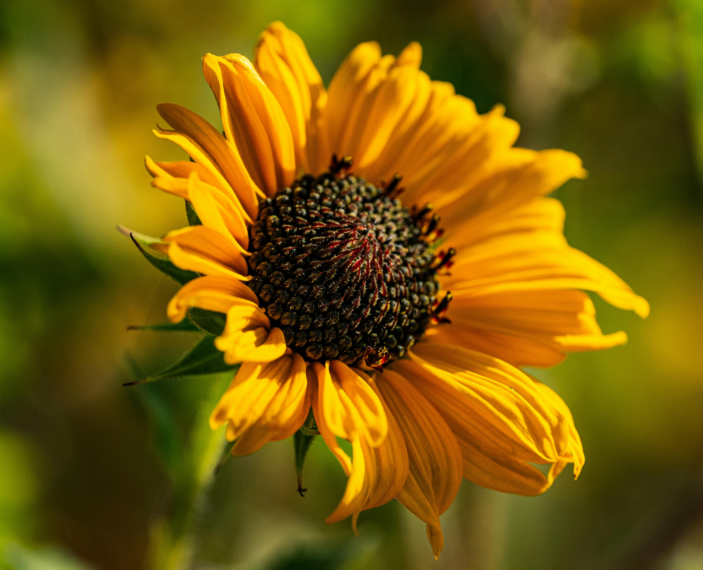
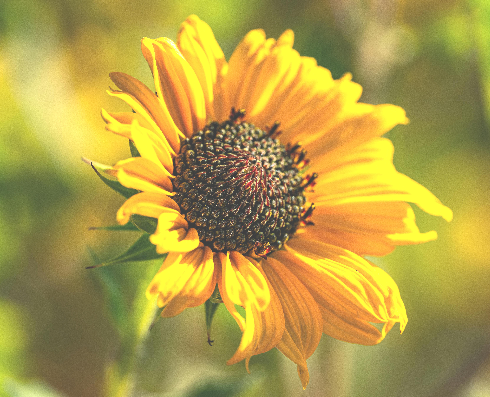
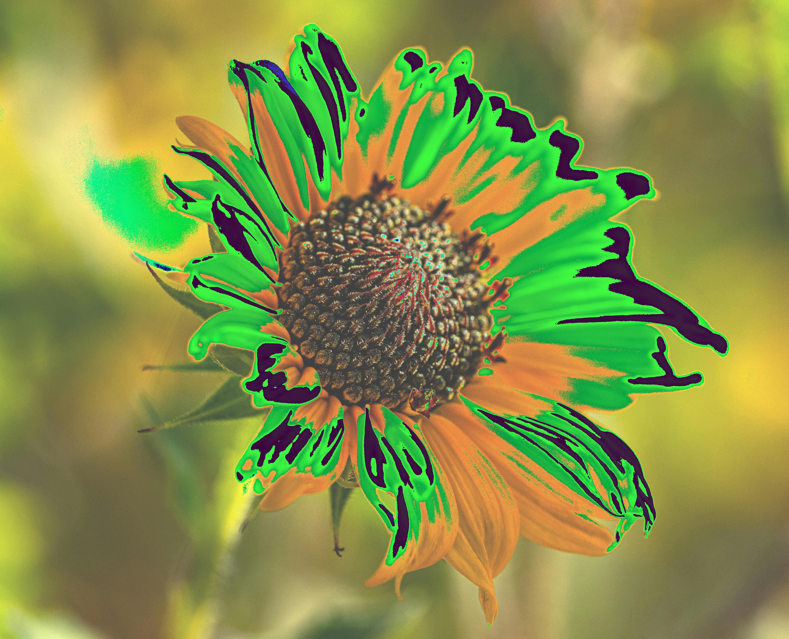
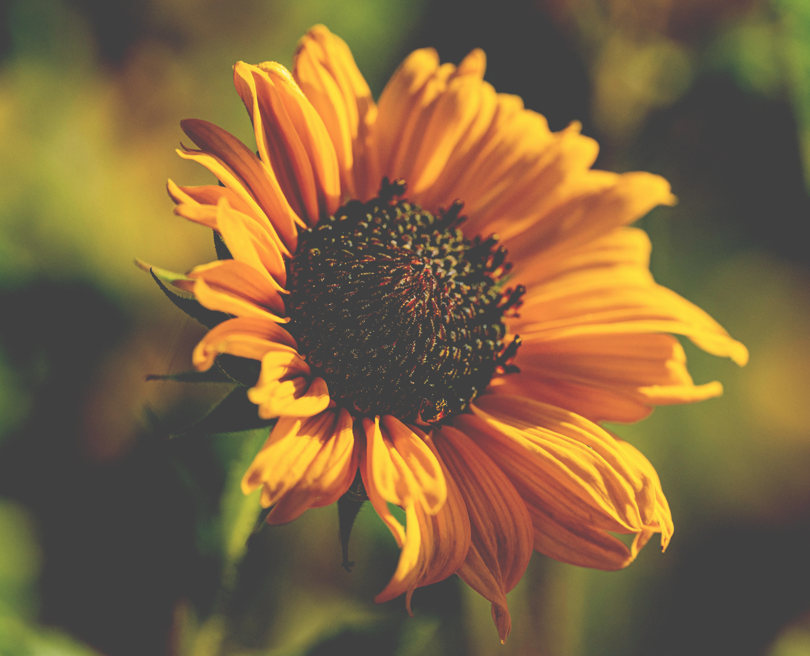
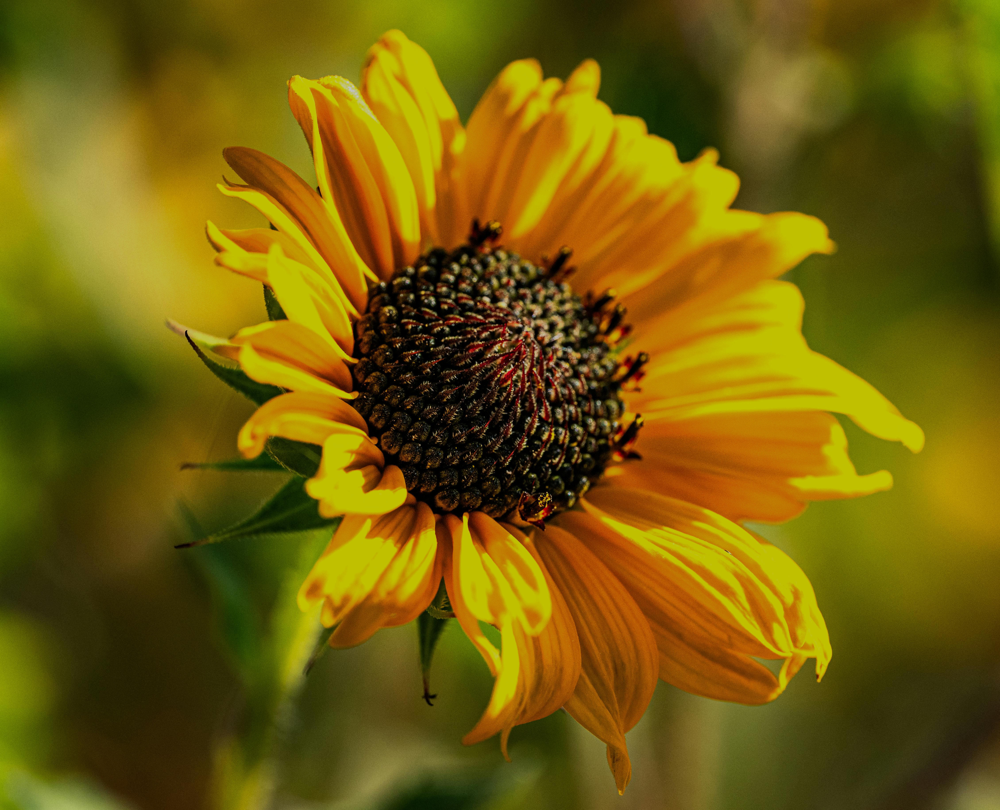

# glipho

Software to create **gli**tchy **pho**tos

> [!NOTE]  
> This project is still in early stage of development, so lot of the stuff mentioned here might not work (yet!)

## About

With this ultra amazing very cool program, you can apply various effects and glitches to images  
Program loads an image, looks at it's pixels as numbers (`0` to `255`) and then applies different operations to each number  
These operations are called `Effects`

### Effects

In this table, you can see all currently supported effect types

| Before                     | After                               | Effect               | Expected values | Description                                                                                                                             |
| -------------------------- | ----------------------------------- | -------------------- | --------------- | --------------------------------------------------------------------------------------------------------------------------------------- |
|  |       | Brightness (64)      | `-255` to `255` | Make image brighter/darker                                                                                                              |
|  |  | Wrap Brightness (64) | `-255` to `255` | Make image brighter/darker. When pixel value exceeds maximal value (`255`) it "wraps" around, making the brightest pixels the most dark |
|  |           | Invert               | _None_          | Inverts the image colors                                                                                                                |
|  |     | Reverse Bits         | _None_          | Reverse the order of bits in each pixel. Looks at pixel like `01000001` and makes it `10000010`                                         |
|  |              | Min (192)            | `0` to `255`    | Applies minimal threshold to all pixels.                                                                                                |
|  |              | Max (64)             | `0` to `255`    | Applies maximal threshold to all pixels.                                                                                                |

> These might not be explained too well, it's always best to try it yourself :)

Effects can be saved to `.json` file, which you can use later

By combining these effects, you can achieve cool effects, for example...

1. `Max(150)`
2. `Min(50)`
3. `Invert`
4. `ReverseBits`
5. `WrapBrightness(-30)`
6. `ReverseBits`
7. `Invert`

...gave this result


## Usage and running

Program comes in two variants

- CLI - console app - lightweight, best for automated scripts, with possibility of interactive mode
- GUI - desktop app - easy to use

### CLI

You can either use [precompiled binary](https://github.com/cyprich/glipho/releases) or build and run via Cargo  
You you have to specify some of these parameters

| Short format | Long format | Description                                 |
| ------------ | ----------- | ------------------------------------------- |
| `-i`         | `--input`   | Path of image, which you want to modify     |
| `-o`         | `--output`  | Path of output image                        |
| `-e`         | `--effects` | Path of file containing effects             |
| `-m`         | `--manual`  | Whether to run in manual (interactive) mode |
| `-h`         | `--help`    | Show help                                   |

#### Manual mode

You can run this program in manual (interactive) mode with the `-m` flag, where you can manually specify input/output images and effects

```bash
# running precompiled binary
./glipho-cli -m
./glipho-cli -m -i image.jpg -o result.jpg -e effects.json

# building from source and running via cargo
cargo run --release --bin cli -- -m
cargo run --release --bin cli -- -m -i image.jpg -o result.jpg -e effects.json
```

#### Automatic mode

You can run this program in automatic (script) mode, but you have to specify the `-i`, `-o` and `-e` flags  
Program will just run, without the need of user interaction, making it ideal for bulk image editing

```bash
# running precompiled binary
./glipho-cli -i image.jpg -o result.jpg -e effects.json

# building from source and running via cargo
cargo run --release --bin cli -- -i image.jpg -o result.jpg -e effects.json
```

### GUI

We have GUI version via [Slint](https://slint.dev/)!  
You can either use [precompiled binary](https://github.com/cyprich/glipho/releases) or build and run via Cargo

```bash
# running precompiled binary
./glipho-gui

# building from source and running via cargo
cargo run --release --bin gui
```

## TODOs and Future plans

- Make it work :)
- Async + show progress
- Downsampling
- Audio Layers
- Modifiers (apply to channel, apply to bits)
- GPU acceleration
